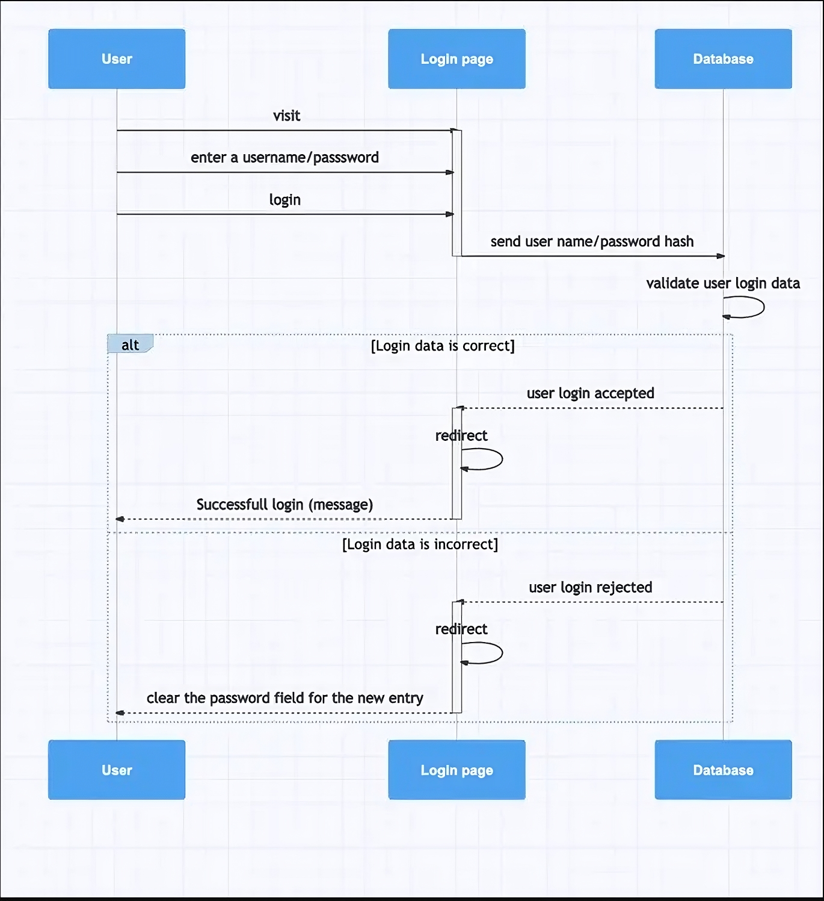
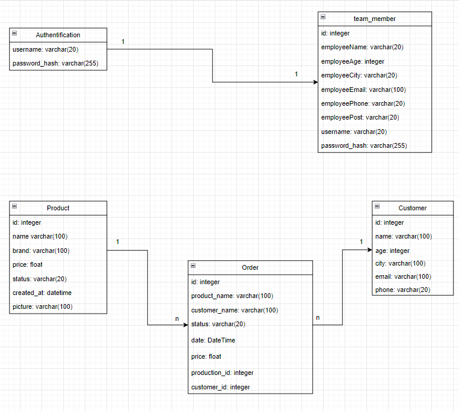

# AdminDash

AdminDash is an admin dashboard application built using Flask SQLAlchemy for the backend and React for the frontend. It provides various features including charts, CRUD tables, and image uploads.

## Table of Contents

- [Features](#features)
- [Architecture](#architecture)
- [Getting Started](#getting-started)
- [Data Model](#data-model)
- [cURL Usage](#curl-usage)
- [Contributing](#contributing)
- [Authors](#authors)
- [License](#license)

## Features

- **Charts**: Visual representation of data using Chart.js and Recharts.
- **CRUD Tables**: Create, Read, Update, and Delete functionality for managing data tables.
- **Image Upload**: Ability to upload images for products and user profile.
- **Authentication**: Secure authentication system to control access to the dashboard.
- **Responsive Design**: Ensures the dashboard is usable on different screen sizes.

## Architecture

AdminDash follows a client-server architecture:

- **Frontend**: The frontend is built using React, a JavaScript library for building user interfaces. It provides the user interface for interacting with the dashboard, including charts, tables, and image uploads.
  
- **Backend**: The backend is built using Flask, a micro web framework for Python. SQLAlchemy is used for database management, allowing for easy interaction with the database. The backend provides RESTful APIs for communication with the frontend, handling CRUD operations and authentication.

## Getting Started

1. Clone the repository:

```
git clone git@github.com:ChahirSaid/AdminDash.git
```

2. Install backend dependencies:

```
pip install -r requirements.txt
```

3. Setup the Flask app:

```
export FLASK_APP=app.py
export FLASK_ENV=development
flask db migrate
flask db upgrade
flask run
```

4. Install frontend dependencies:

```
cd React-app
npm install
```

5. Start the React app:

```
npm run dev
```
## Data Model

#### Authentication Data Model



The authentication data model represents the process of employee authentication.

- **User**: Represents a user of the application. Contains fields such as username, email, password hash, and role. For employees, the **User** entity stores their login credentials.

- **Role**: Defines different roles that users can have, such as admin, employee, or customer. Employees are assigned a specific role that determines their access permissions within the system.

When an employee tries to log in, the system verifies their credentials against the **User** entity. If the username and password hash match an employee's credentials, the system redirects them to the main page. Otherwise, the system displays a credentials error message.


#### Tables UML Diagram



The UML diagram above represents the tables used in the data model:

- **Product**: Represents a product available in the system. Contains fields such as product name, description, price, and quantity.

- **Order**: Represents an order placed by a customer. Contains fields such as order ID, customer ID, product ID, quantity, and order date.

- **Customer**: Represents a customer who places orders. Contains fields such as customer ID, name, email, and address.

- The diagram above illustrates the relationship between the **Employee** entity and the **User** entity for authentication purposes.

## cURL Usage

To interact with the backend API using cURL, you can make requests to the appropriate endpoints. For example:

```bash
# Get all orders
curl -X GET http://localhost:5000/api/orders

# Create a new customer
curl -X POST -H "Content-Type: application/json" -d '{"name":"John Doe","age":30,"city":"New York","email":"john@example.com","phone":"1234567890"}' http://localhost:5000/api/customers

# Update an existing customer by id
curl -X PUT -H "Content-Type: application/json" -d '{"name":"John Smith","age":35}' http://localhost:5000/api/customers/1

# Delete an order by id
curl -X DELETE http://localhost:5000/api/orders/1
```

## Contributing

Contributions are welcome! Please follow the standard GitHub flow:

1. Fork the repository.
2. Create a new branch (`git checkout -b feature/feature-name`).
3. Make your changes.
4. Commit your changes (`git commit -am 'Add new feature'`).
5. Push to the branch (`git push origin feature/feature-name`).
6. Create a new Pull Request.

## Authors

AdminDash was created and is maintained by the following individuals:

- **Said Chahir** - Lead Developer - [@ChahirSaid](https://github.com/ChahirSaid)
- **Othmane Boubecheur** - Lead Developer - [@glackyy](https://github.com/glackyy)

## License

This project is licensed under the MIT License - see the [LICENSE](LICENSE) file for details.